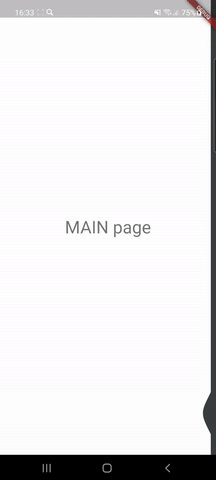
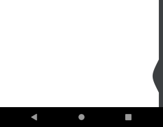
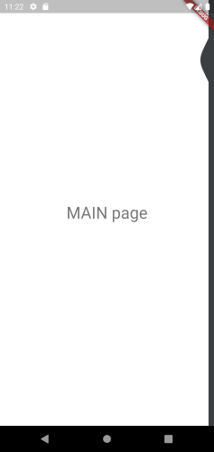
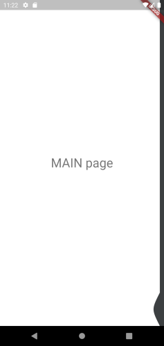

# Elastic Drawer

Elastic panel that slides in horizontally to show fully customize content (navigation links, menu items, notes etc.)

  

## How to use

```
@override
  Widget build(BuildContext context) {
    return ElasticDrawer(
      mainColor: Colors.white,
      drawerColor: Color(0xff3C3F41),
      mainChild: Column(
        children: [
          Text('MAIN content'),
          ...
        ]
      ),
      drawerChild: Column(
        children: [
          Text('DRAWER content'),
          ...
        ]
      ),
    );
  }
```

If you want to navigate inside use **ElasticDrawerKey.navigator**
```
InkWell(
  onTap: (){
    ElasticDrawerKey.navigator.currentState.push(
      MaterialPageRoute(
        builder: (context) => YourNextPage()
      )
    );
    ...
  },
)
```

If you want to close drawer programmatically use **ElasticDrawerKey.drawer**
```
InkWell(
  onTap: (){
    ElasticDrawerKey.drawer.currentState.closeElasticDrawer(context);
    ...
  },
)
```

Use parameter **markWidth** to set width of touch mark (0..1)

  

Use parameter **markPosition** to set vertical position of touch mark (0..1)

  
